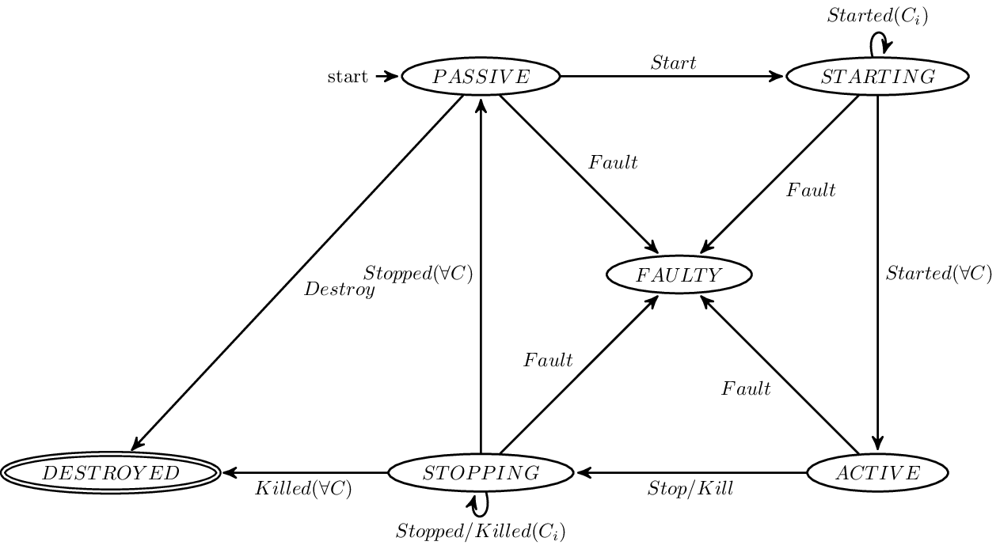

.. _kilifecycle:

Kompics Lifecycle
=================

    Kompics Lifecycle Overview.

Every Kompics component has a lifecycle of 6 specific states it can be in, which controls what kind of events it will execute and when it will be deallocated (and thus allowed to be garbage collected eventually).

These 6 states are

.. hlist::
    :columns: 2

    * ``PASSIVE``
    * ``STARTING``
    * ``ACTIVE``
    * ``STOPPING``
    * ``FAULTY``
    * ``DESTROYED``

and are defined in :java:ref:`Component.State`.

The transitions between these states happen via the following events on the :java:ref:`ControlPort` or a fault (an exception being thrown) in one of the component's handlers, or the method :java:ref:`ComponentCore.markSubtreeAs(State)` (during fault handling):

.. hlist::
    :columns: 2

    * :java:ref:`Start`
    * :java:ref:`Started`
    * :java:ref:`Stop`
    * :java:ref:`Stopped`
    * :java:ref:`Kill`
    * :java:ref:`Killed`

Typical Lifecycle
-----------------

Every component *C* begins in ``PASSIVE`` after creation. In this mode no events are handled except lifecycle events, all other events are simply queued up on their respective ports.

The handling of a :java:ref:`Start` event moves *C* into the ``STARTING`` state, where it still won't handle anything but lifecycle events. *C* automatically forwards the :java:ref:`Start` event to all its children und waits for them to reply with :java:ref:`Started`. Once all children have done so, *C* moves into the ``ACTIVE`` state and replies to its parent component with :java:ref:`Started`. The ``ACTIVE`` state is the normal operating state of a component, where it handles all events as described previously during the :ref:`tutorial`.

The handling of a :java:ref:`Stop` or :java:ref:`Kill` events changes *C*'s state to ``STOPPING``. As before, it forwards the respective event to all its children and waits for :java:ref:`Stopped` or :java:ref:`Killed` messages from all of them before proceeding. However, a ``STOPPING`` component handles events on other ports normally. Once all replies are received the component moves into the ``PASSIVE`` state and sends :java:ref:`Stopped` or :java:ref:`Killed` to its parent component. If the original event was :java:ref:`Stop` it simply remains there until restarted as above. If the original event was :java:ref:`Kill` the component will run :java:ref:`ComponentCore.destroyTree(ComponentCore)` to sever all its connections and set its whole subtree to ``DESTROYED``. From here it can not be restarted and parent components should take care to clean up any remaining references to the component, so that it will be garbage collected eventually.

.. note::

    It is possible to inspect a component's current state via :java:ref:`Component.state()`, for example to judge during handler execution if a component is already ``STOPPING``. However, it should be noted that calls to this method are not synchronised in any way, and may return inconsistent results due to concurrent modification. They should thus be regarded as a mere indicatior of state, not a guarantee.

Exception Lifecycle
-------------------

If a fault occurs during the execution of a handle in component *C*, its whole subtree will be set to ``FAULTY`` immediately (not interrupting running handlers in its children, but preventing handling of further events). Consequently the parent component *P*'s :java:ref:`ComponentDefinition.handleFault(Fault)` method will be consulted to resolve the issue. If not overriden, the fault is simply escalated from level to level, until eventually the root fault handler causes resolution (for example, via either system shutdown or a complete restart of the hierarchy). Other choices of :java:ref:`Fault.ResolveAction` besides ``ESCALATE`` are:

    * ``RESOLVED``, which causes no further within the Kompics systems, the assumption being that the user somehow resolved the issue
    * ``IGNORE``, which causes resumption of *C* and its subtree, by setting it to ``PASSIVE`` and triggering a :java:ref:`Start` event.
    * ``DESTROY``, causing the whole subtree of *C* to be scrapped immediately.

